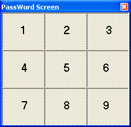



## KeyPad

### Description

I made this program to protect the main from from being access by an unwanted user. The curent code is 13337. So you would have to click the numbers in the same order 13337 for it to launch the main form hope you guys like. :)
 
### More Info
 

             |
---                |---
**Submitted On**   |2004-11-21 13:39:52
**By**             |[Jeremy Banker](https://github.com/Planet-Source-Code/PSCIndex/blob/master/ByAuthor/jeremy-banker.md)
**Level**          |Beginner
**User Rating**    |4.0 (12 globes from 3 users)
**Compatibility**  |VB 6\.0
**Category**       |[Miscellaneous](https://github.com/Planet-Source-Code/PSCIndex/blob/master/ByCategory/miscellaneous__1-1.md)
**World**          |[Visual Basic](https://github.com/Planet-Source-Code/PSCIndex/blob/master/ByWorld/visual-basic.md)
**Archive File**   |[KeyPad18206911212004\.zip](https://github.com/Planet-Source-Code/jeremy-banker-keypad__1-57360/archive/master.zip)

